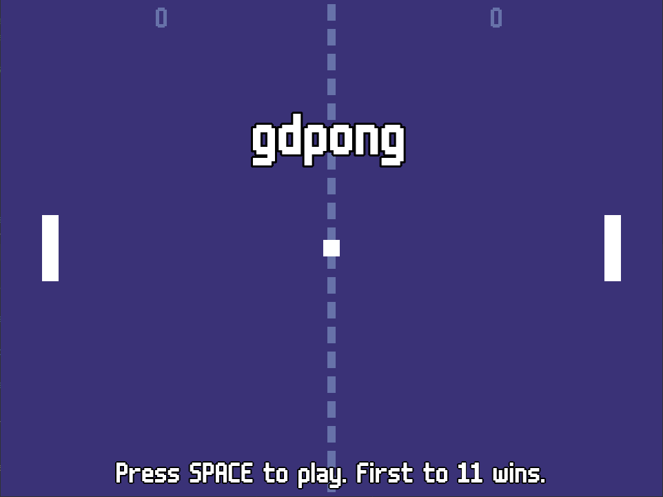

<p align="center">
  <a href="https://godotengine.org/" target="blank"></a>
</p>
<p align="center">
    Pong in Godot 4.
</p>

## Description

Get the ball in the other player's goal. First to 11 wins. Balls hit out of bounds don't affect the score. Requires 2 players.

## Controls

```yaml
Game:
  Exit: Escape
  Select: Space
  Restart: R
Player 1:
  Move Up: W
  Move Down: S
  Serve: A
Player 2:
  Move Up: Up Arrow
  Move Down: Down Arrow
  Serve: Right Arrow
```

## Credits

### Engine

[Godot v4.3.dev6.official](https://godotengine.org/download/archive/4.3-dev6/).

### Font

[m6x11](https://managore.itch.io/m6x11), created by Daniel Linssen.

### Palette

<p>
  <a href="https://lospec.com/palette-list/arq4" target="blank"></a>
</p>

[ARQ4 PALETTE](https://lospec.com/palette-list/arq4), created by ENDESGA.
